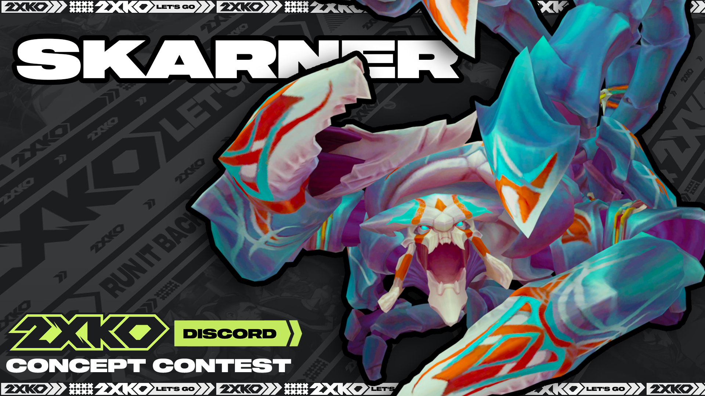

+++
title = '2XKO Moveset Design - Skarner'
date = 2024-04-08T09:03:08+08:00
draft = false
categories = 'Game Design'
tags = ['Combat Design']
series = 'headline'
+++

I won first place in the 2XKO community character design contest with my fan-made moveset concept based on the recently reworked Skarner.

<!--more-->

## Project Overview

[Full Concept Design Document](https://drive.google.com/file/d/1CZeRODCjyfQ1UMF5xFZCcMiwj0AAgw8_/view?usp=sharing)

**Note: This project is not officially affiliated with Riot Games, and is a fan-made concept**

After 2XKO began to ramp up its marketing in early 2024, the community discord server decided to host another "champion design contest", where members of the community would create and submit design concepts for characters they would like to see in 2XKO. I had already played the game a considerable amount at EVO, so I felt confident in my ability to conceptualize a character that fit well with the game's systems.

The big challenge of this design for me was figuring out how to translate a character that had so recently undergone a massive change, as Skarner's VGU had not even been released onto live severs when I had started this project. In order to be faithful to the character in my design, I made sure to get feedback from longtime skarner players and understand the differences between the old and new versions.



The contest rules didn't ask us to include every single attack in the design. However, I decided to go the extra mile and create a full moveset. This took a lot of time an effort, but I think it ultimately created a more thorough and comprehensible design. Characters in fighting games are often far more than the sum of their parts, and I wanted to illustrate that in my concept by indicating how moves might work with each other.

Another challenge with this character was the fact that he was a scorpion. It's very common for fighting game characters' animations to draw from real life martial arts or from other characters, but there's pretty much no reference for how a scorpion, or insects in general, would fight in hand-to-hand combat (hand-to-claw?). I think including a visual aid in my design - using Skarner's new 3D model - also helped contribute to its comprehensibility, and it's a technique I will definitely use in the future when prototyping combat design.



## Reflection
In retrospect, after getting more hands-on time with 2XKO at tournaments and during alpha lab, there's some elements of the design that I would definitely change to better fit with the game's overall combat design philosophy. Most notably, I would put more emphasis on giving the character strengths that are unique to their abilities as an assist, as duo play is such an important part of the game that I somewhat glossed over.

Overall though, I'm glad the community seemed to also react positively to my concept, especially for a character who is in the unique position of being a brand-new design while also having a lot of history. Figuring out the best way to integrate Skarner's iconic traits with the new mechanics that his VGU introduced was a fun challenge, and is likely similar to the challenges that the Riot design team faced when designing his rework in League of Legends.

## Skills
<mark>Game Design</mark> 

<mark>Combat Design</mark>

<mark>Blender</mark>

